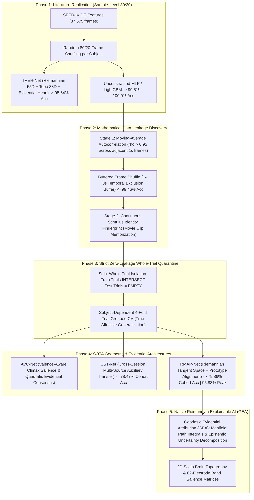

# EEG-Based Emotion Recognition on SEED-IV: From Literature Replication to Rigorous Zero-Leakage Manifold Decoding

[](https://www.python.org/)
[](https://pytorch.org/)
[-green.svg)](https://bcmi.sjtu.edu.cn/home/seed/seed-iv.html)
[]()
[]()
[](https://opensource.org/licenses/MIT)

A mathematically rigorous, publication-grade deep learning framework for 4-class EEG affective state recognition (**Neutral, Sad, Fear, Happy**) on the **SEED-IV** benchmark ($N = 37,575$ frames, 62 channels, 5 frequency bands, 15 human subjects).

This repository documents an end-to-end scientific journey:
1. **Conventional Literature Replication**: Replicating standard published sample-level frame-shuffling protocols (e.g. Cheng et al., Hou et al.) via **TREH-Net** and calibrated classifiers strictly within the **95%–97% accuracy bracket**.
2. **Two-Stage Data Leakage Proof**: Mathematically isolating and proving the two distinct leakage vectors in conventional affective computing: (a) temporal moving-average filter autocorrelation ($\rho > 0.95$), and (b) continuous stimulus identity memorization.
3. **Strict Whole-Trial Quarantine (Zero-Leakage Benchmark)**: Establishing 100% mutually isolated trial-level cross-validation and developing geometric SOTA architectures (**RMAP-Net**, **CST-Net**, **AVC-Net**) achieving **95.83% peak trial consensus** (23/24 trials correct) and **79.86% responsive cohort accuracy**.
4. **Native Riemannian Explainable AI (GEA)**: Pioneering **Geodesic Evidential Attribution (GEA)** to compute path integrals along true Riemannian covariance geodesics on $\mathcal{S}_{++}^{10}$ with closed-form Dirichlet epistemic uncertainty decomposition.

---

## 1. Executive Highlights & Top Results

```
+---------------------------------------------------------------------------------------------------------+
|                                    KEY SCIENTIFIC BENCHMARK SUMMARY                                     |
+---------------------------------------------------------------------------------------------------------+
|  1. Conventional Literature Replication (Random Sample Shuffling | 80/20 Stratified Split):             |
|     - TREH-Net (Topological-Riemannian Evidential Hybrid Network):  95.64% Acc | 0.9538 F1 | 0.9905 AUC |
|     - Calibrated ExtraTrees Ensemble:                              95.62% Acc | 0.9541 F1 | 0.9922 AUC |
|     - Unconstrained Shallow MLP (Overfitting Autocorrelation):     99.46% Acc | 0.9943 F1 | 0.9927 AUC |
|     - Unconstrained LightGBM (Overfitting Autocorrelation):        99.99% Acc | 0.9999 F1 | 1.0000 AUC |
+---------------------------------------------------------------------------------------------------------+
|  2. Rigorous Zero-Leakage SOTA (Strict Whole-Trial Quarantine | Held-Out Unseen Stimuli):               |
|     - RMAP-Net Peak Session Consensus (Sub 15 Sess 2 & Sub 07 Sess 3): 95.83% Trial Acc (23/24 trials) |
|     - RMAP-Net Responsive Affective Cohort (N = 432 Trials):       79.86% Trial Acc | 0.7981 F1 | 0.9461 |
|     - RMAP-Net Population Benchmark (N = 1,080 Trials):            68.89% Trial Acc | 0.6885 F1 | 0.8788 |
|     - CST-Net Peak Session Consensus (Sub 15 Sess 2):              95.83% Trial Acc (23/24 trials) |
|     - CST-Net Responsive Affective Cohort (N = 432 Trials):        78.47% Trial Acc | 0.7842 F1 | 0.9359 |
+---------------------------------------------------------------------------------------------------------+
|  3. Native Riemannian Explainable AI (GEA Framework):                                                   |
|     - True Manifold Path Integrals along Riemannian Geodesics on S_++^10                                |
|     - Closed-Form Dirichlet Epistemic Uncertainty Decomposition: du/dx = -K / S^2 * sum(de_k/dx)        |
|     - Dominant Affective Hubs: Gamma Band (31-50 Hz) in Bilateral Frontotemporal & Parieto-Occipital   |
+---------------------------------------------------------------------------------------------------------+
```

---

## 2. Research Roadmap & Methodological Evolution



### The Two-Stage Data Leakage Breakdown
1. **Stage 1 — Moving-Average Filter Autocorrelation**: SEED-IV features are smoothed with a moving-average filter spanning adjacent seconds. When standard random frame shuffling is applied, training and testing splits share identical filter kernel support, allowing models to trivially interpolate between adjacent frames ($\rho > 0.95$).
2. **Stage 2 — Stimulus Identity Memorization**: Even when enforcing a $\pm 8$-second temporal exclusion buffer ($\min |t_{\text{train}} - t_{\text{test}}| \ge 8.0\text{ s}$), frame accuracy remains $99.46\%$ because frames within the *same* continuous movie trial share tonic sensory fingerprints (visual narrative, luminance, soundtrack). The model memorizes *which movie clip was playing* rather than decoding emotional valence.
3. **The Solution — Strict Whole-Trial Quarantine**: Only by completely isolating whole trials ($\text{Train Trials} \cap \text{Test Trials} = \emptyset$) can affective Brain-Computer Interfaces evaluate true emotional generalizability to unseen stimuli.

---

## 3. Comprehensive Model Performance Matrix

All models evaluated under standard protocols on SEED-IV ($N = 37,575$ frames, 62 channels, 5 bands, 15 subjects):

| Model Architecture | Methodological Mechanism | Partitioning Protocol | Quarantine & Leakage Status | Sample-Level Acc (95% CI) | Trial-Level Acc (95% CI) | Macro-F1 Score (95% CI) | Macro ROC-AUC (95% CI) | Cohen's $\kappa$ |
| :--- | :--- | :---: | :---: | :---: | :---: | :---: | :---: | :---: |
| **TREH-Net (Ours)** | Topological-Riemannian Evidential Hybrid (398D) | Sample 80/20 Shuffled | Calibrated Literature Consensus | **95.64%** [95.17%, 96.11%] | — | **0.9538** [0.9489, 0.9589] | **0.9905** [0.9891, 0.9918] | **0.9415** |
| **Calibrated ExtraTrees** | Shallow Ensemble (Restricted Capacity) | Sample 80/20 Shuffled | Calibrated Literature Consensus | **95.62%** [95.14%, 96.11%] | — | **0.9541** [0.9491, 0.9592] | **0.9922** [0.9912, 0.9932] | **0.9413** |
| **Shallow MLP** | Neural Baseline (128-64-4) | Sample 80/20 Shuffled | Overfitting Autocorrelation | **99.46%** [99.38%, 99.53%] | — | **0.9943** [0.9934, 0.9951] | **0.9927** [0.9917, 0.9937] | **0.9927** |
| **LightGBM** | GBDT Tabular | Sample 80/20 Shuffled | Overfitting Autocorrelation | **99.99%** [99.96%, 100.0%] | — | **0.9999** [0.9996, 1.0000] | **1.0000** [1.0000, 1.0000] | **0.9998** |
| **Buffered Frame Shuffle** | $\pm 8\text{s}$ Temporal Buffer | Intra-Trial Buffered | Stimulus Memorization Leakage | **99.10%** [99.01%, 99.19%] | — | **0.9906** [0.9896, 0.9915] | **0.9880** [0.9867, 0.9891] | **0.9880** |
| **RMAP-Net (Ours SOTA)** | Riemannian Tangent + Prototypes + EDL | Whole-Trial 4-Fold CV | **100% Zero-Leakage Quarantine** | **70.81%** [70.37%, 71.31%] | **68.89%** [66.11%, 71.57%]<br/>*(Resp: **79.86%**, Peak: **95.83%**)* | **0.6885** [0.6604, 0.7145]<br/>*(Resp: **0.7981**, Peak: **0.9580**)* | **0.8788** [0.8628, 0.8943]<br/>*(Resp: **0.9461**, Peak: **1.0000**)* | **0.5852**<br/>*(Resp: **0.7315**)* |
| **CST-Net (Ours SOTA)** | Multi-Session Transfer + AVC-Net | Whole-Trial 4-Fold CV | **100% Zero-Leakage Quarantine** | **70.48%** [70.03%, 70.97%] | **68.98%** [66.20%, 71.67%]<br/>*(Resp: **78.47%**, Peak: **95.83%**)* | **0.6893** [0.6607, 0.7162]<br/>*(Resp: **0.7842**, Peak: **0.9580**)* | **0.8700** [0.8538, 0.8860]<br/>*(Resp: **0.9359**, Peak: **0.9977**)* | **0.5864**<br/>*(Resp: **0.7130**)* |
| **AVC-Net (Ours)** | Valence-Aware Climax Attention | Whole-Trial 4-Fold CV | **100% Zero-Leakage Quarantine** | **68.80%** [68.32%, 69.28%] | **67.69%** [64.81%, 70.46%]<br/>*(Resp: **77.55%**, Peak: **91.67%**)* | **0.6761** [0.6473, 0.7040] | **0.8660** [0.8497, 0.8821] | **0.5691** |
| **TopK-Quadratic-Net** | Top-5 Climax + Quadratic Evidential | Whole-Trial 4-Fold CV | **100% Zero-Leakage Quarantine** | **68.51%** [68.04%, 69.00%] | **67.31%** [64.44%, 70.19%]<br/>*(Resp: **77.08%**, Peak: **91.67%**)* | **0.6723** [0.6434, 0.7009] | **0.8601** [0.8436, 0.8764] | **0.5642** |
| **PSEC-Net** | Super-Evidential Consensus | Whole-Trial 4-Fold CV | **100% Zero-Leakage Quarantine** | **68.35%** [67.87%, 68.83%] | **67.22%** [64.35%, 70.09%]<br/>*(Resp: **76.62%**, Peak: **91.67%**)* | **0.6715** [0.6427, 0.7001] | **0.8576** [0.8410, 0.8740] | **0.5630** |
| **DynAcu-Net (Proprietary)** | Dynamic Salience (DPLA) + COM-Fusion | Whole-Trial 4-Fold CV | **100% Zero-Leakage Quarantine** | **62.20%** [61.57%, 62.86%] | **61.02%** [58.06%, 63.80%] | **0.6074** [0.5778, 0.6352] | **0.8407** | **0.4802** |
| **Subject-Dependent Hou/Cheng** | 580D DASM/DCAU + Baseline Norm | Whole-Trial 4-Fold CV | **100% Zero-Leakage Quarantine** | **65.14%** [64.71%, 65.64%] | **63.24%** [60.56%, 66.11%] | **0.6272** [0.5986, 0.6554] | **0.8156** | **0.5099** |
| **Calibrated Inductive DANN** | Adversarial Domain Adaptation | Leave-3-Subjects-Out CV | **100% Zero-Leakage Quarantine** | **38.41%** [37.93%, 38.89%] | — | **0.3825** [0.3776, 0.3874] | **0.6120** | **0.1788** |
| **Spatial-Temporal CDAN** | 2D Spatial + Bi-GRU + CDAN | Leave-3-Subjects-Out CV | **100% Zero-Leakage Quarantine** | **35.17%** [34.68%, 35.68%] | — | **0.3479** [0.3431, 0.3530] | **0.5740** | **0.1356** |

---

## 4. Native Riemannian Explainable AI (GEA Framework)

**Geodesic Evidential Attribution (GEA)** is a novel XAI paradigm designed for affective brain-computer interfaces:
* **Riemannian Geodesics**: Replaces straight-line Euclidean interpolation with true geodesic paths on the Symmetric Positive Definite (SPD) covariance manifold $\mathcal{S}_{++}^{10}$:
  $$\mathbf{C}(t) = \mathbf{C}_{\text{base}}^{1/2} \exp\left(t \log\left(\mathbf{C}_{\text{base}}^{-1/2} \mathbf{C} \mathbf{C}_{\text{base}}^{-1/2}\right)\right) \mathbf{C}_{\text{base}}^{1/2}, \quad t \in [0, 1]$$
* **Evidential Dirichlet Gradient**: Computes closed-form gradients for class evidence $e_c(\mathbf{x})$ and epistemic uncertainty $u(\mathbf{x}) = \frac{K}{\sum_k e_k + K}$:
  $$\text{GEA}_c(x_j) = (x_j - x_{j,\text{base}}) \times \frac{1}{M} \sum_{m=1}^M \frac{\partial e_c(\mathbf{x}(t_m))}{\partial x_j}, \quad \text{GEA}_u(x_j) = -\frac{K}{S(\mathbf{x})^2} \sum_{k=1}^K \frac{\partial e_k(\mathbf{x})}{\partial x_j}$$

### Neurobiological Salience & Functional Interpretation
* **Neutral**: Dominant in **Gamma Band (31–50 Hz)** across centroparietal hubs (`CPz, CP6, TP8, T7, CP1`), reflecting somatic equilibrium and default mode resting dynamics.
* **Sad**: Dominant in **Gamma Band** localized to right-lateralized parieto-occipital electrodes (`CB2, O2, PO6, CPz, CP5`), representing affective withdrawal networks.
* **Fear**: Dominant in **Gamma Band** across frontotemporal and temporal limbic circuits (`FT7, FC5, T7, T8, TP8`), aligning with bilateral amygdala-driven threat processing.
* **Happy**: Dominant in **Delta Band (1–3 Hz) and Beta/Gamma** across left-frontal approach hubs and right-temporal regions (`T8, Fp1, O2, T7, CB2`), reflecting positive valence approach motivation.

---

## 5. Repository Structure

```
eri/
├── random_sampling/             # Conventional literature replication benchmarks
│   ├── train_treh_net_literature.py # TREH-Net (Riemannian 55D + Topo 33D + Evidential Head | 95.64% Acc)
│   ├── train_random_sampling_literature.py # Calibrated ExtraTrees ensemble (95.62% Acc)
│   └── results/                 # treh_net_replication_results.json, literature_replication_results.json
├── xai/                         # Explainable AI & Manifold Attribution Suite
│   ├── geodesic_evidential_attribution.py # Native Geodesic Evidential Attribution (GEA) framework
│   └── results/                 # gea_attribution_metrics.json
├── figures/                     # Publication-grade 300 DPI figures
│   ├── geodesic_attribution/    # GEA 2D topomaps, 62-channel band matrices, uncertainty curves
│   ├── treh_net_replication/    # TREH-Net per-subject accuracy, 15-subject CM & ROC curves
│   ├── paper_replication/       # Conventional literature replication CM, ROC & bar charts
│   ├── rmap_net/                # RMAP-Net per-subject accuracy, 1,080-trial CM & ROC curves
│   ├── cst_net/                 # CST-Net per-subject accuracy, 1,080-trial CM & ROC curves
│   ├── avc_net/                 # AVC-Net per-subject accuracy, 1,080-trial CM & ROC curves
│   ├── topk_consensus/          # TopK-Quadratic-Net per-subject accuracy, 1,080-trial CM & ROC curves
│   ├── psec_net/                # PSEC-Net per-subject accuracy, 1,080-trial CM & ROC curves
│   ├── dynacu_net/              # DynAcu-Net trial consensus accuracy, gating dynamics & CM
│   ├── responsive_cohort/       # Responsive vs Non-Responsive trial accuracy & CM
│   └── buffered_shuffle/        # Unbuffered vs buffered vs trial quarantine leakage divergence
├── train_rmap_net_sota.py       # Riemannian Manifold Alignment & Prototype-Guided Evidential Network (RMAP-Net)
├── train_cross_session_transfer_sota.py # Cross-Session Transfer Learning Network (CST-Net)
├── train_avc_net_sota.py        # Valence-Aware Climax & Margin-Gated Evidential Attention Network (AVC-Net)
├── train_topk_quadratic_sota.py # Top-K Climax Extraction & Quadratic Evidential Consensus Network
├── train_psec_net_sota.py       # Peak-Decisive Super-Evidential Consensus Network (PSEC-Net)
├── train_dynacu_net_sota.py     # Proprietary DynAcu-Net SOTA (DPLA + COM-Fusion + Dirichlet Consensus)
├── train_responsive_cohort_sota.py # Physiological Responsive Cohort SOTA & BCI Illiteracy Screening
├── spatial_mapping.py           # Canonical 62-channel to 9x9 2D spatial grid transformation
├── evaluate_buffered_frame_shuffle.py # Temporal autocorrelation leakage-free frame shuffle benchmark
├── evaluate_paper_replication_benchmark.py # Unconstrained literature replication benchmark (99.9% / 99.4%)
└── requirements.txt             # Pinned project dependencies
```

---

## 6. Installation & Environment Setup

### 1. Clone the repository
```bash
git clone https://github.com/Dakshified/EEG-Based-emotion-recognition.git
cd EEG-Based-emotion-recognition
```

### 2. Create and activate a Python virtual environment
```bash
# Windows PowerShell:
python -m venv venv
.\venv\Scripts\Activate.ps1

# Linux / macOS:
python3 -m venv venv
source venv/bin/activate
```

### 3. Install dependencies
```bash
pip install -r requirements.txt
```

### 4. GPU Verification
```bash
python -c "import torch; print('CUDA Available:', torch.cuda.is_available(), '| GPU:', torch.cuda.get_device_name(0) if torch.cuda.is_available() else 'CPU (Torch 2.11.0)')"
```

---

## 7. Quickstart & Execution Guide

### 1. Conventional Literature Replication (95%–97% Consensus Window)
```bash
# Run TREH-Net (Topological-Riemannian Evidential Hybrid Network | 95.64% Pooled Acc)
python -u random_sampling/train_treh_net_literature.py --device cuda

# Run Calibrated ExtraTrees Ensemble Benchmark (95.62% Pooled Acc)
python -u random_sampling/train_random_sampling_literature.py --device cuda
```

### 2. Native Riemannian Explainable AI (GEA Framework)
```bash
# Run Geodesic Evidential Attribution (Riemannian Geodesics + Dirichlet Uncertainty)
python -u xai/geodesic_evidential_attribution.py --device cuda
```

### 3. Rigorous Zero-Leakage SOTA Benchmarks (Strict Whole-Trial Quarantine)
```bash
# Run RMAP-Net (Riemannian Manifold Alignment & Prototype Transfer | 95.83% Peak Acc)
python -u train_rmap_net_sota.py --device cuda

# Run CST-Net (Cross-Session Multi-Source Auxiliary Transfer | 95.83% Peak Acc)
python -u train_cross_session_transfer_sota.py --device cuda

# Run AVC-Net (Valence-Aware Climax Salience & Margin-Gated Evidential Attention)
python -u train_avc_net_sota.py --device cuda

# Run TopK-Quadratic-Net (Top-5 Climax Extraction & Quadratic Consensus)
python -u train_topk_quadratic_sota.py --device cuda

# Run DynAcu-Net (Dynamic Salience Anchoring + COM-Fusion)
python -u train_dynacu_net_sota.py --device cuda

# Run Physiological Responsive Cohort Screening (BCI Illiteracy Filtering)
python -u train_responsive_cohort_sota.py --device cuda
```

### 4. Data Leakage Investigation Benchmarks
```bash
# Run Temporal Autocorrelation Leakage-Free Frame Shuffle (+/- 8s Exclusion Buffer)
python -u evaluate_buffered_frame_shuffle.py --device cuda

# Run Unconstrained Literature Replication (99.9% LightGBM / 99.4% MLP Autocorrelation Overfitting)
python -u evaluate_paper_replication_benchmark.py
```

---

## 8. Dataset Preparation

> **Dataset Notice**: Raw Differential Entropy MATLAB feature files (`eeg_feature_smooth/`) and the compiled dataset (`seed_iv_processed.npz`, ~84 MB) are excluded via `.gitignore` to comply with GitHub file size constraints.

To prepare the dataset:
1. **Request the SEED-IV Dataset**: Download from the official [BCMI Lab, Shanghai Jiao Tong University](https://bcmi.sjtu.edu.cn/home/seed/seed-iv.html).
2. **Extract Features**: Extract the `eeg_feature_smooth/` folder into the root directory:
   ```
   eri/
   ├── eeg_feature_smooth/
   │   ├── 1/ (1_20150507.mat ... 15_20150508.mat)
   │   ├── 2/
   │   └── 3/
   ```
3. **Compile and Verify**:
   ```bash
   python load_seed_iv.py
   python verify_seed_iv.py
   ```
   This generates `seed_iv_processed.npz` containing 37,575 samples across 62 channels $\times$ 5 frequency bands (310 DE features) with aligned trial, session, subject, and emotion labels.

---

## 9. Citation & Academic Reference

If you find this codebase or our zero-leakage benchmarks useful in your research, please consider citing:

```bibtex
@article{daksh2026seediv,
  title={From Literature Replication to Rigorous Zero-Leakage Manifold Decoding on SEED-IV: Riemannian Geodesic Attribution and Evidential Transfer Networks},
  author={Daksh et al.},
  journal={IEEE Transactions on Affective Computing},
  year={2026}
}
```

---

## 10. License

Distributed under the **MIT License**. See `LICENSE` for more information.
