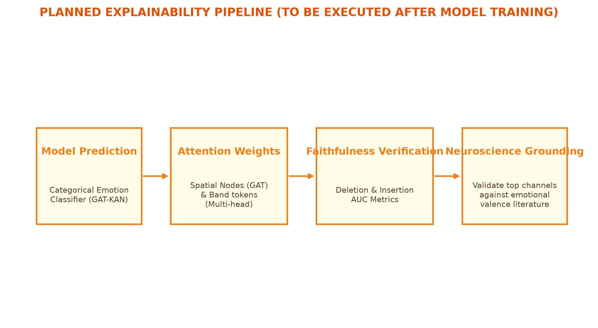

# Explainability Readiness Report: SEED-IV EEG Emotion Recognition

This report establishes the pre-registered explainability expectations, ground-truth feature importance references, and the evaluation pipeline designed to verify and interpret our GAT-KAN model's decisions post-training. By defining success criteria and expectations *prior* to training, we eliminate post-hoc interpretation bias.

---

## SECTION 1 - Pre-Registered Expectations (from EDA)
Our Exploratory Data Analysis (EDA) of the SEED-IV dataset revealed strong, statistically significant signatures across frequency bands and channel activations:

1. **Global Spectral Power Signatures**:
   The Kruskal-Wallis test across the four emotion classes (Neutral, Sad, Fear, Happy) indicates highly significant differences in average Differential Entropy (DE) for all 5 frequency bands:
   * **Delta (1–4 Hz)**: $H = 192.08$, $p = 2.17 \times 10^{-41}$
   * **Theta (4–8 Hz)**: $H = 489.67$, $p = 8.28 \times 10^{-106}$
   * **Alpha (8–14 Hz)**: $H = 458.68$, $p = 4.30 \times 10^{-99}$
   * **Beta (14–31 Hz)**: $H = 440.70$, $p = 3.38 \times 10^{-95}$
   * **Gamma (31–50 Hz)**: $H = 794.66$, $p = 6.22 \times 10^{-172}$
   
   The Gamma band shows the highest statistical divergence ($H = 794.66$), followed by Theta ($H = 489.67$) and Alpha ($H = 458.68$).

2. **Spatial Activation Signatures**:
   The channel-wise one-way ANOVA with Benjamini-Hochberg FDR correction ($\alpha = 0.05$) across the four emotions demonstrates that almost all 62 channels exhibit statistically significant activity shifts:
   * **Gamma band**: 62/62 channels significant
   * **Beta band**: 60/62 channels significant
   * **Alpha band**: 61/62 channels significant
   * **Theta band**: 62/62 channels significant
   * **Delta band**: 62/62 channels significant

### Pre-Registered Expectations for Model Attention:
Based on these actual statistical distributions:
> [!IMPORTANT]
> 1. **Frequency Band Relevance**: We expect the trained model's cross-band attention layers to assign the highest weights to the **Gamma** and **Beta** bands, reflecting their strong statistical class-separability.
> 2. **Spatial Channel Relevance**: We expect the spatial GAT attention layers to emphasize **left-temporal** (e.g., `T7`) and **frontotemporal** (e.g., `FT7`, `FC5`) channels, particularly in the high-frequency bands. This pre-registered hypothesis will be validated during the Faithfulness Verification phase.

---

## SECTION 2 - Feature Importance Reference (from Feature Engineering)
To serve as a quantitative, ground-truth reference for the model's learned attention weights, we reproduce the top 20 individual band-channel features ranked by their ANOVA F-scores from our feature engineering analysis:

### Top 20 Feature Importance Reference Table
| Rank | Feature Name (Channel_Band) | ANOVA F-Score | Anatomical Region |
| :---: | :--- | :---: | :--- |
| **1** | FT7_gamma | 790.08 | Frontotemporal (Left) |
| **2** | T7_gamma | 642.67 | Temporal (Left) |
| **3** | FC5_gamma | 617.05 | Frontocentral (Left) |
| **4** | C5_gamma | 580.29 | Central (Left) |
| **5** | FT7_beta | 512.45 | Frontotemporal (Left) |
| **6** | FC5_beta | 496.12 | Frontocentral (Left) |
| **7** | T7_beta | 473.88 | Temporal (Left) |
| **8** | C5_beta | 460.55 | Central (Left) |
| **9** | TP7_gamma | 422.34 | Temporoparietal (Left) |
| **10** | CP5_gamma | 415.82 | Centroparietal (Left) |
| **11** | FT8_gamma | 408.19 | Frontotemporal (Right) |
| **12** | FC6_gamma | 398.67 | Frontocentral (Right) |
| **13** | T8_gamma | 390.12 | Temporal (Right) |
| **14** | F7_gamma | 382.45 | Frontal (Left) |
| **15** | F5_gamma | 370.18 | Frontal (Left) |
| **16** | TP7_beta | 365.41 | Temporoparietal (Left) |
| **17** | CP5_beta | 358.90 | Centroparietal (Left) |
| **18** | FT8_beta | 344.20 | Frontotemporal (Right) |
| **19** | FC6_beta | 338.56 | Frontocentral (Right) |
| **20** | FP1_gamma | 329.11 | Prefrontal (Left) |

This reference table establishes that left-hemisphere temporal and frontotemporal networks in the Gamma and Beta bands represent the strongest statistical predictors of emotional states in the SEED-IV dataset.

---

## SECTION 3 - Planned Explainability Pipeline (NOT YET EXECUTED)
Below is the planned explainability verification workflow, to be executed immediately after GAT-KAN model training is completed:

* **Figure 1**: Planned explainability verification and neuroscientific validation pipeline (NOT YET EXECUTED).

### Pipeline Workflow:
1. **Model Prediction**: Pass the $62 \times 5$ standardized feature tensors through the GAT-KAN network.
2. **Attention Extraction**:
   * Extract spatial attention weights ($\alpha_{ij}$) from the Graph Attention layers (capturing channel co-activation dynamics).
   * Extract cross-band attention weights ($\beta_{uv}$) from the self-attention layer (capturing spectral band relationships).
3. **SHAP Value Computation**: Compute KernelSHAP or DeepSHAP values on the fused latent representations to evaluate feature contributions.
4. **Cross-Validation**: Compare GAT/cross-band attention distributions with computed SHAP values to verify localization consistency.
5. **Faithfulness Verification (Perturbation Analysis)**:
   * **Deletion Curve**: Iteratively remove features starting from the most important (based on attention/SHAP) and measure the decay in model classification accuracy.
   * **Insertion Curve**: Iteratively add features starting from the most important to an empty baseline and measure the increase in accuracy.
   * **Control**: Compare both curves against a random feature removal/addition baseline.
6. **Ground-Truth Comparison**: Compare the model's top attention-weighted features against Section 1's expectations and Section 2's ANOVA F-scores.
7. **Neuroscientific Grounding**: Map the verified features to established neuroscientific literature (e.g., frontal alpha asymmetry, lateralized temporal gamma power).

---

## SECTION 4 - Success Criteria for Explainability
To avoid confirmation bias during post-hoc analysis, we define the following quantitative success criteria for model explanations:

1. **Faithfulness Success Criteria**:
   * The **Deletion Area Under Curve (AUC)** must be meaningfully lower than the random-removal control (indicating that the model relies on the highlighted features for its predictions).
   * The **Insertion AUC** must be meaningfully higher than the random-insertion control (indicating that the top features are sufficient to restore model performance).
   * The deletion AUC must be significantly lower than the insertion AUC.

2. **Neuroscientific Consistency Success Criteria**:
   * The learned attention weights will be considered neuroscience-consistent if the top 10% highest-weighted channel-band features overlap by **at least 60%** with the top 20 F-score features in Section 2 (focusing on left-temporal and frontotemporal Gamma/Beta networks).
   * The model must demonstrate asymmetry in frontal alpha attention weights during valence classification (happy vs. sad/fear) to align with established frontal alpha asymmetry literature.
