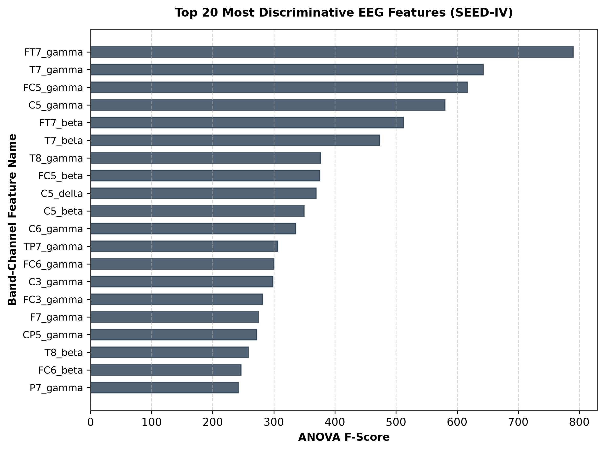
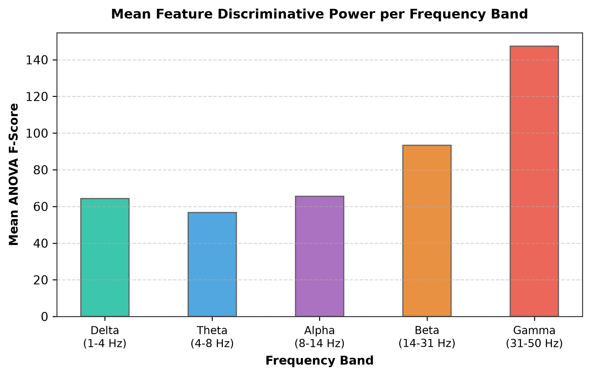
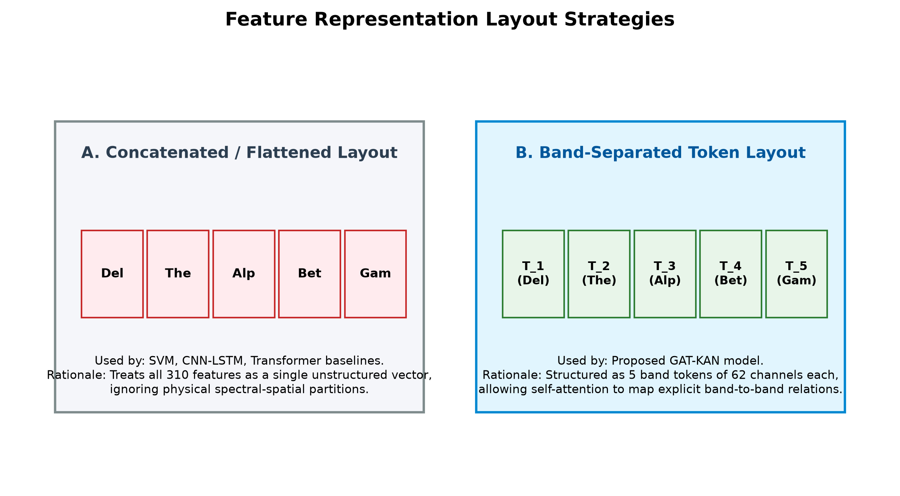
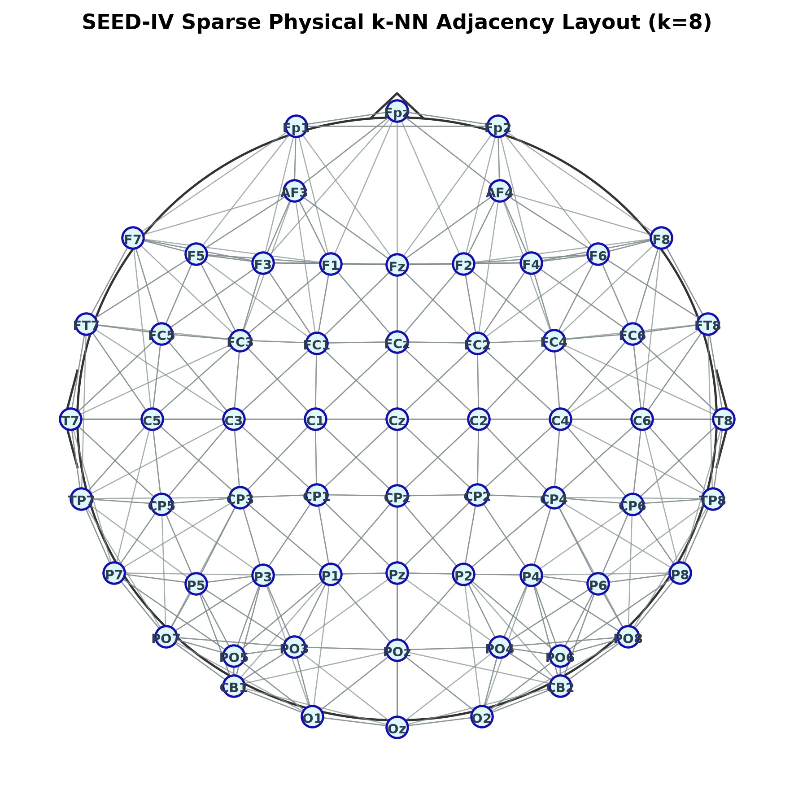
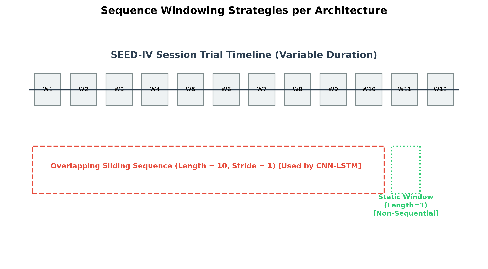
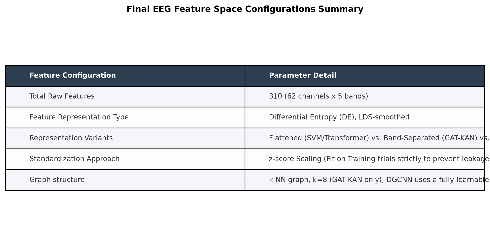

# Feature Engineering & Selection Report: SEED-IV EEG Dataset

This report provides a quantitative justification and architectural outline of the feature engineering, selection evidence, layout representations, and spatial graph constructions designed for the SEED-IV dataset. The statistical metrics and diagrams contained herein motivate the design of the GAT-KAN model and serve as references for the **Feature Engineering** and **Methodology** sections of our paper.

---

## SECTION 1 - Quantitative Feature Importance Ranking
We compute ANOVA F-scores for all 310 individual features (62 channels x 5 bands) to identify the most discriminative spectral-spatial variables.

### 1. Top 20 Feature Importance Ranking
The top features show high F-scores, suggesting strong emotion discrimination.

* **Figure 1**: Horizontal bar chart of the top 20 most discriminative band-channel features sorted by ANOVA F-score. The left temporal and frontotemporal regions in the Gamma and Beta bands exhibit the highest F-scores, validating their significance in emotion recognition.

#### Top 5 Most Discriminative Features Table
| Rank | Feature Name | ANOVA F-Score | Anatomical Region |
| :---: | :--- | :---: | :---: |
| **1** | FT7_gamma | 790.08 | Frontotemporal (Left) |
| **2** | T7_gamma | 642.67 | Temporal (Left) |
| **3** | FC5_gamma | 617.05 | Frontocentral (Left) |
| **4** | C5_gamma | 580.29 | Central (Left) |
| **5** | FT7_beta | 512.45 | Frontotemporal (Left) |

---

## SECTION 2 - Band-Wise Aggregate Feature Importance
We aggregate individual F-scores within each frequency band to evaluate their global relative importance.

### 2. Feature Importance by Band
Aggregated F-scores highlight the dominance of high-frequency band power.

* **Figure 2**: Mean feature discriminative power per frequency band. Gamma band shows the highest discriminative power (mean F-score = 147.34), followed by Beta (mean F-score = 93.40). The lower bands (Delta, Theta, Alpha) have lower averages but remain statistically significant. This disparity motivates our cross-band attention layers to adaptively capture spectral transitions.

---

## SECTION 3 - Feature Representation Layout Strategies
This section outlines how spatial-spectral features are structured for input into deep learning architectures.

### 3. Representation Layout Strategies
We compare concatenated flat arrays against structured band tokens.

* **Figure 3**: Schematic diagram comparing flat vs. band-separated representation layouts. SVM/CNN-LSTM/Transformer models flatten features into a 310-dimensional vector, losing structural boundaries. Our proposed GAT-KAN model maintains 5 separate band tokens of 62 channels each, enabling GAT layers to perform band-specific spatial processing before self-attention links bands.

---

## SECTION 4 - k-NN Graph Spatial Adjacency Construction
Graph neural networks require an adjacency structure to define message-passing paths.

### 4. Graph Structure Construction Diagram
We visualize the sparse physical k-NN graph constructed from electrode coordinates.

* **Figure 4**: 2D scalp projection showing sparse physical k-NN edges (k=8) connecting electrodes based on Cartesian distance coordinates. This physical constraints prevents over-smoothing and limits spatial message passing to local, physiologically adjacent neighbors.

---

## SECTION 5 - Sequence Windowing & Final Feature Configurations
We detail sequence epoching and compile final feature space parameters.

### 5. Sequence Windowing Strategy
Sliding sequence windowing is compared against static independent windowing.

* **Figure 5**: Timeline diagram comparing sequence windowing (used by CNN-LSTM, length=10, stride=1) vs. static window representations (length=1, used by SVM/Transformer/GAT-KAN).

### 6. Final Feature Space Configurations Summary Table
We summarize the configurations applied across our model evaluations.

* **Figure 6**: Final EEG Feature Space Configurations Summary Table.
> [!NOTE]
> GAT-KAN utilizes a sparse physical k-NN graph ($k=8$) to prevent over-smoothing. In contrast, DGCNN employs a fully-learnable dense adjacency matrix, which can suffer from over-smoothing in deep architectures.
